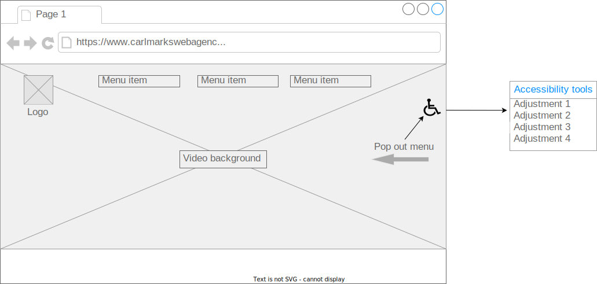
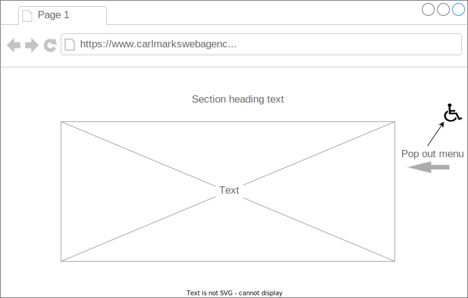
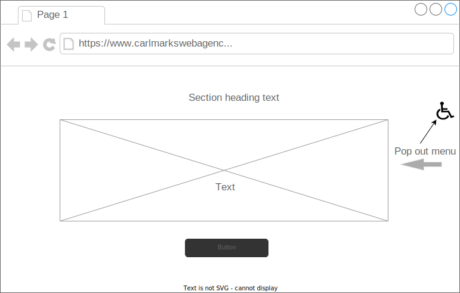
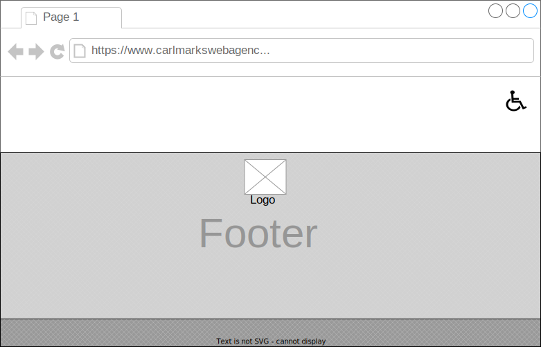

# CarlMarks web agency

CarlMarks web agency is a duo of web developers who are passionate about serving the needs of a wide spectrum of clientele. The agency was founded by the duo during their time at Founders and coders skills bootcamp and has gone from strength to strength ever since!
CarlMarks take pride in their business approach which is: friendly, approachable and easily accessible to all.

## User story

As a visually impaired entrepreneur, I want to be able to browse the website of my chosen sub contractor so that I can better understand the services they offer.
As an entrepreneur, I frequently sub contract web developers to build functional user interfaces for the projects I am working on. This is not a straightforward task for a visually impaired user, so a website with a high standard of accessibility options is of utmost importance.
An intuitive and easy to navigate website, enormously improves my productivity therefore adding more value to my project as a whole.

## Acceptance criteria

- [ ] Navigate to other sections of the page from the homepage/landing
- [ ] Have brief descriptions of the team/developers
- [ ] Contact form
- [ ] Easy to find accessibility menu
- [ ] Able to change various display features of the website
- [ ] User cannot submit a form without filling out all of the mandatory fields
- [ ] Information from the form doesn’t get submitted until the user clicks a button
#### Stretch:
- [x] Use the automatic trigger functionality of GitHub project board

## Wireframe:

